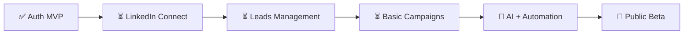

# 📋 Guía de Testing y MVP - EficacIA

## 1. SETUP PREVIO

### Variables de Entorno Requeridas
Verifica que tu `.env` tenga:
```env
VITE_API_URL=http://localhost:3001  # Local dev
# O para Vercel:
VITE_API_URL=https://tu-dominio.vercel.app

SUPABASE_URL=https://tu-proyecto.supabase.co
SUPABASE_KEY=tu-anon-key
SUPABASE_SERVICE_ROLE_KEY=tu-service-role-key

STRIPE_SECRET_KEY=sk_live_...
STRIPE_PUBLISHABLE_KEY=pk_live_...

JWT_SECRET=tu-secret
```

### Base de Datos - Verificar Schema
En Supabase SQL Editor, ejecuta:
```sql
-- Verificar que la tabla users existe y tiene las columnas correctas
SELECT * FROM public.users LIMIT 1;

-- Verificar columnas clave
-- Deberías ver: id, email, full_name, subscription_plan, subscription_status, trial_ends_at
```

---

## 2. FLUJOS DE AUTENTICACIÓN A TESTEAR

### ✅ Flujo 1: Registrarse con Código Gratis (SIN TARJETA)

**Pasos:**
1. Ve a `https://tu-app.vercel.app/register`
2. Rellena:
   - Nombre: `Test User`
   - Email: `test@example.com`
   - Contraseña: `Test123456`
   - Código: `EficaciaEsLoMejor2026`
3. Haz clic en "Registrarse con Código Gratis"

**Resultado Esperado:**
- ✅ Usuario creado en Supabase
- ✅ Plan: `pro`
- ✅ Trial de 7 días activado
- ✅ Redirige a `/dashboard`
- ✅ Dashboard carga sin errores

**Verificación en Supabase:**
```sql
SELECT * FROM public.users WHERE email = 'test@example.com';
-- Deberías ver: subscription_plan='pro', subscription_status='trial'
```

---

### ✅ Flujo 2: Registrarse con Stripe (CON TARJETA)

**Pasos:**
1. Ve a `https://tu-app.vercel.app/pricing`
2. Elige un plan (Starter o Pro)
3. Haz clic en "Empezar 7 Días Gratis"
4. Serás redirigido a Stripe
5. **Para Test:** Usa tarjeta: `4242 4242 4242 4242` | Mes: `12` | Año: `25` | CVC: `123`
6. Complete email y datos (pueden ser ficticios)
7. Serás redirigido a `/register?session_id=...&plan=...`
8. Los datos están pre-llenados, solo escribe contraseña
9. Haz clic en "Activar Trial de 7 Días"

**Resultado Esperado:**
- ✅ Pago de €0 procesado en Stripe
- ✅ Usuario creado con datos de Stripe
- ✅ `stripe_customer_id` y `stripe_subscription_id` guardados
- ✅ Trial de 7 días activado
- ✅ Redirige a `/dashboard`

**Verificación en Supabase:**
```sql
SELECT * FROM public.users WHERE email = 'test@stripe.com';
-- Deberías ver: stripe_customer_id, stripe_subscription_id, subscription_status='trial'
```

---

### ✅ Flujo 3: Login

**Pasos:**
1. Ve a `https://tu-app.vercel.app/login`
2. Usa credenciales del usuario creado anteriormente
3. Haz clic en "Iniciar Sesión"

**Resultado Esperado:**
- ✅ Te loguea correctamente
- ✅ Token JWT guardado en localStorage
- ✅ Redirige a `/dashboard`

---

## 3. TESTING DEL DASHBOARD

### Alertas y Errores a Verificar

#### ❌ Error: "Unexpected token 'T', not valid JSON"
**Causa:** Endpoint de LinkedIn que no existe
**Status:** ✅ CORREGIDO - URLs ahora apuntan al backend correcto

**Verificación:**
- Abre DevTools (F12)
- Ve a Console
- No deberías ver error "Error fetching accounts"
- Deberías ver un mensaje limpio o vacío

#### ❌ Activity Logs mostrando datos falsos
**Causa:** Logs hardcodeados sin lógica real
**Status:** ✅ CORREGIDO - Solo muestra mensaje de "sin actividad" ahora

---

### Secciones del Dashboard

Haz clic en cada sección y verifica que:

#### 1. **Accounts** (Cuentas LinkedIn)
- [ ] Se carga sin errores en Console
- [ ] Muestra: "No hay cuentas conectadas" (esperado al inicio)
- [ ] Hay un formulario para agregar sesión de LinkedIn
- [ ] Botón "Conectar Cuenta" existe

**Nota:** No funciona ahora porque LinkedIn no está configurado. Esto es normal.

#### 2. **Leads**
- [ ] Se abre sin errores
- [ ] Muestra: "No hay leads" o tabla vacía
- [ ] Hay botones para "Importar CSV", "Buscar en LinkedIn", "Agregar Manual"

**Nota:** No hay datos aún porque no hay cuentas conectadas.

#### 3. **Campaigns**
- [ ] Se carga sin errores
- [ ] Muestra: "No hay campañas" (esperado)
- [ ] Hay botón "Nueva Campaña"

#### 4. **Activity Logs**
- [ ] Muestra mensaje: "Las secuencias de automatización se mostrarán aquí cuando estén habilitadas"
- [ ] ✅ No hay logs falsos

#### 5. **Pricing**
- [ ] Se carga correctamente
- [ ] Muestra ambos planes (Starter, Pro)
- [ ] Botones funcionan

#### 6. **Settings** (Pronto)
- [ ] Aun no implementado, es normal

---

## 4. CHECKLIST DE VERIFICACIÓN TÉCNICA

### Console del Navegador (DevTools → Console)

```
✅ Sin errores rojos (Exceptions)
✅ Sin "Unexpected token" errors
✅ Sin "fetch failed" errors
✅ Token JWT en localStorage
```

**Cómo verificarlo:**
```javascript
// En Console, ejecuta:
localStorage.getItem('auth_token')  // Debería mostrar un JWT largo
localStorage.getItem('user')        // Debería mostrar JSON del usuario
```

### Network Tab (DevTools → Network)

Haz una acción (como cargar Accounts) y:
```
✅ Status 200 = OK
❌ Status 404 = Endpoint no existe
❌ Status 500 = Error del servidor
```

---

## 5. MVP - Funcionalidades Core Hoy

### 🟢 COMPLETADO - Listo para Usar
- ✅ Autenticación (Email/Password)
- ✅ Registro con código de prueba gratis
- ✅ Integración con Stripe (crear sesión, procesar pago €0, redireccionar)
- ✅ JWT tokens
- ✅ Dashboard estructura básica
- ✅ Acturaización de perfil básica

### 🟡 EN PROGRESO - Próximos Pasos
- ⏳ **LinkedIn Integration**
  - [ ] Conectar cuenta (session cookie)
  - [ ] Verificar validez de sesión
  - [ ] Scraping de perfiles básico

- ⏳ **Leads Management**
  - [ ] Crear leads manually
  - [ ] Importar CSV
  - [ ] Ver tabla de leads

- ⏳ **Campaigns Básicas**
  - [ ] Crear campaña vacía
  - [ ] Ver campaign details

### 🔴 TODO - Futuro
- Sequence builder automático
- Envío de mensajes automático
- AI personalization
- Webhooks de Stripe
- Analytics avanzados

---

## 6. PLAN DE TESTING ORDENADO

### Semana 1: Autenticación Funcional
```
Lunes:   Testing de registro (código + Stripe)
Martes:  Testing de login
Miércoles: JWT tokens y persistencia
Jueves:  Dashboard carga sin errores
Viernes: Integración auth + Supabase
```

### Semana 2: Leads Básicos
```
Testing manual import (CSV)
Testing CRUD de leads
Tabla de leads funcional
Filtros por estado
```

### Semana 3: LinkedIn Lite
```
Conectar sesión (WIP)
Validar sesión
Scraping básico (búsqueda simple)
```

### Semana 4: Campaigns
```
Crear campaña
Seleccionar leads
Vista básica de sequence
```

---

## 7. ERRORES COMUNES Y SOLUCIONES

### Error: "RLS Policy Error"
**Causa:** Service role key no configurado
**Solución:** 
```env
SUPABASE_SERVICE_ROLE_KEY=eyJ... (debe ser service_role, no anon)
```

### Error: "Unexpected token 'T'"
**Causa:** Endpoint retorna HTML en lugar de JSON
**Solución:** ✅ Ya corregido - las URLs ahora van al backend correcto

### Error: "No autenticado"
**Causa:** Token expirado o no guardado
**Solución:**
```javascript
// En Console:
localStorage.clear()
// Vuelve a hacer login
```

### Error: "Team not found"
**Causa:** Usuario creado sin equipo
**Solución:** Se debe crear automáticamente en el futuro. Por ahora es normal.

---

## 8. COMANDOS ÚTILES

### Local Development
```bash
# Terminal 1 - Frontend
npm run dev:frontend

# Terminal 2 - Backend
npm run dev:backend

# Ambos
npm run dev
```

### Production (Vercel)
```bash
# Los cambios se despliegan automáticamente con git push
git add .
git commit -m "feat: descripción"
git push origin main
```

### Debugging
```bash
# Ver logs de Vercel
vercel logs

# Ver base de datos
# Ve a: https://app.supabase.com → Projects → Tu proyecto → SQL
```

---

## 9. SIGN-OFF DE TESTING

Una vez completing todos los puntos anteriores:

- [ ] Registro con código funciona
- [ ] Registro con Stripe funciona
- [ ] Login funciona
- [ ] Dashboard carga sin errores
- [ ] Console limpia (sin errors rojos)
- [ ] Supabase tiene datos correctos
- [ ] Activity logs limpios
- [ ] No hay alertas rojas

**Fecha completado:** _______________

**Conclusión:** El MVP de autenticación está listo. Proceder con LinkedIn integration.

---

## 10. NEXT STEPS



Hablamos cuando hayas corrido los tests. Puedo ayudarte con cualquier error que encuentres.
